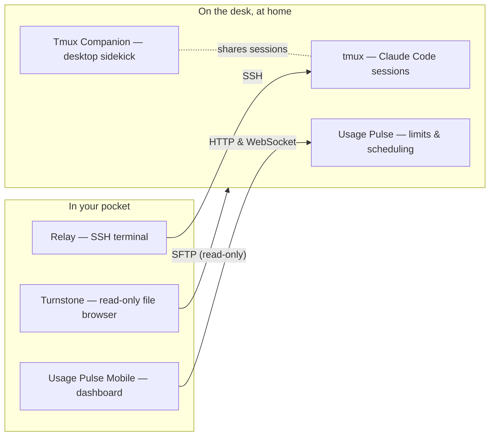

<h1 align="center">Beehive</h1>

  
  

  Made by
  <a href="https://beecode.rs"><strong>Beecode</strong></a>

The hub of the [Beecode](https://beecode.rs) tool ecosystem: a set of small, sharply
focused apps built around one workflow — **developing on the move, with the laptop left
behind**.

This repository is a directory, not a codebase. Each tool lives in its own repo;
everything open source is public under the
[beecode-rs](https://github.com/beecode-rs) organization.

## The apps

| App | What it does |
|---|---|
|  **[Usage Pulse](https://github.com/beecode-rs/usage-pulse)** Desktop (Electron) | Watches your coding-plan usage limits (the 5-hour window as a ring, the weekly/monthly window as a bar), lists every running Claude Code session — local and over SSH — and schedules tiny prompts timed to open fresh 5-hour windows that together cover a whole workday. |
|  **[Relay](https://github.com/beecode-rs/relay)** Mobile (Expo, Android & iOS) | An SSH terminal in your pocket: manage a list of servers, connect, and drive a remote shell — e.g. Claude Code in tmux — from your phone. |
|  **[Text Lantern](https://github.com/beecode-rs/text-lantern)** Menu bar (Electron) | Reads the currently selected text aloud, fully on-device, through Piper neural voices (Serbian and English shipped, any other addable) and Kokoro. |
| 🚧 **Turnstone** Mobile (Expo, Android) | Browses and reads files on a remote server over SSH, strictly read-only: file tree, syntax-highlighted code, rendered Markdown and HTML, PDF, remote search, git status and diffs, and live watching of remote changes. |
| 🚧 **Usage Pulse Mobile** Mobile (Expo) | A read-only companion for Usage Pulse: the same usage and session dashboard on your phone over the VPN, plus local notifications when a session finishes or a usage warning fires. |
| 🚧 **Tmux Companion** Desktop (Electron) | Manages tmux sessions across the local machine and SSH hosts: suffixed per-app sessions, an embedded terminal running your real tmux, and one-click launches into an OS terminal. Shares its session naming with Relay, so phone and desktop continue the same tmux sessions. |

## The idea: development without the laptop

The dev machine stays at home, on the desk, doing the heavy lifting. You walk away with
just a phone. A VPN ([Tailscale](https://tailscale.com) — or anything else that gives
IP-level reachability) makes the machine addressable from anywhere, and from there the
phone is the workstation:

- **Claude Code (or any terminal app) runs on the dev machine, inside tmux** — sessions
  survive disconnects, so a coding session started from the couch continues on the train.
- **Mobile development (Expo) works end to end** — dev servers, builds and logs are all
  reachable through the tunnel.
- **Browser apps work the same way** — the dev server runs at home, and any device on
  the VPN opens it.
- **The one limitation is desktop (Electron) apps** — there is no screen around to watch
  them on. The Claude Code session building them can still be monitored and controlled
  from the phone; only live visual testing has to wait until you are back at the desk.

## How it fits together

Every connection rides the VPN — the dev machine is never exposed to the open internet.

## Built the clean way

Every project in the hive is written in TypeScript and follows the
**[writing-clean-ts](https://github.com/beecode-rs/claude-skills/tree/main/skills/writing-clean-ts)**
conventions — layered patterns for services, repositories, DALs, entities, controllers,
and React components. The skill is open source too, in the
[beecode-rs](https://github.com/beecode-rs) space.

## More to come

The hive is growing. More small tools for the on-the-move setup are in the works —
watch this repo or the
[beecode-rs organization](https://github.com/orgs/beecode-rs/repositories?type=source)
to see them land.
